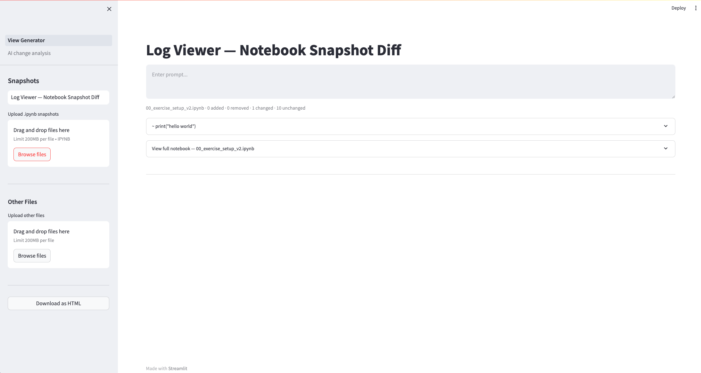
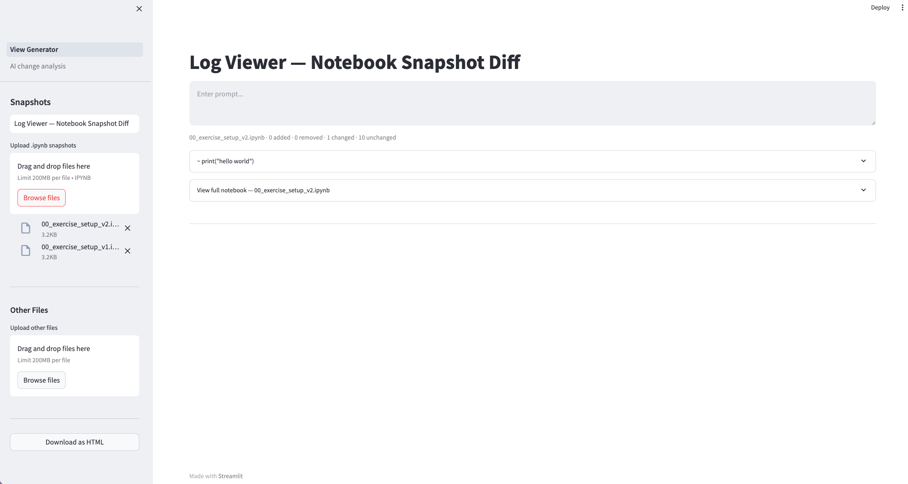
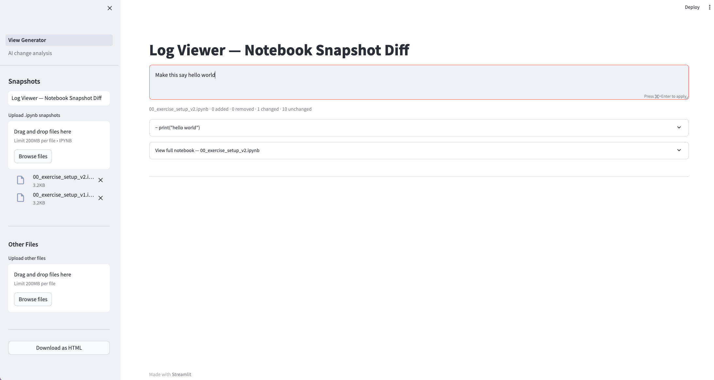
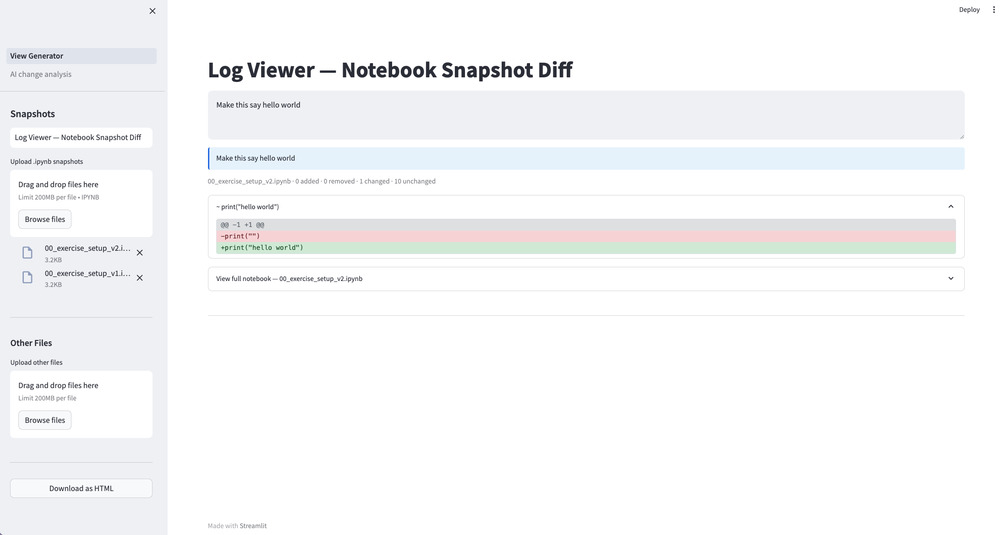
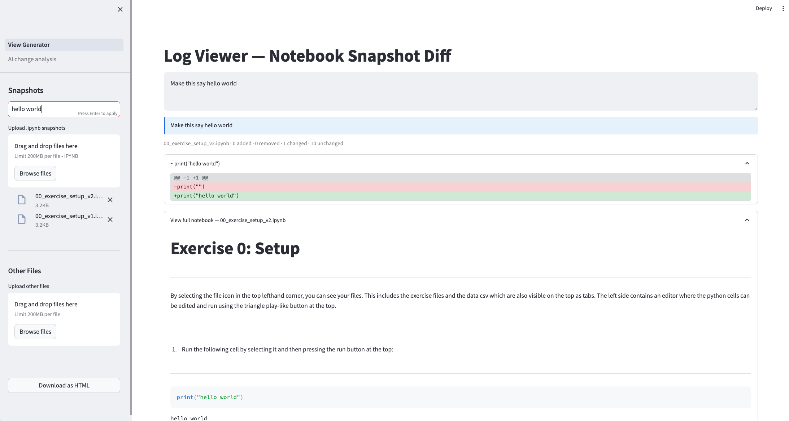
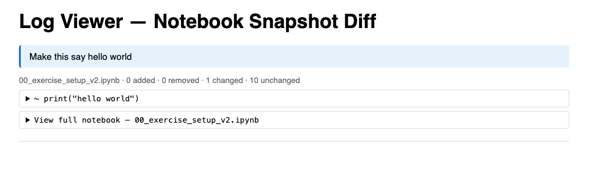

# Log Viewer Analysis

A Streamlit app for visualizing and analyzing notebook diffs from log snapshots.

## Features

- Upload `.ipynb` snapshot files to generate a side-by-side diff
- Pair each diff with the prompt that drove the change (manual entry to ensure correct pairing)
- Browse code changes alongside the full notebook context
- Export diffs as standalone HTML files
- In progress - AI-powered change analysis via the AI Change Analysis page

## Live Application

The app is available at https://log-viewer-analysis.streamlit.app/

An API key is required for the AI Change Analysis page. Contact Caroline at caroline.berger@cs.au.dk to request a key.

## Getting Started

### Install dependencies

```bash
pip install -r requirements.txt
```

### Run the app

```bash
streamlit run View_Generator.py
```

### Usage

1. Upload `.ipynb` snapshot files (before and after) - order by v1, v2, ...
2. Paste the prompt from the logs that corresponds to the change
3. Inspect the generated diff — added/removed cells are highlighted
4. Export to HTML for sharing or later analysis

## Screenshots







